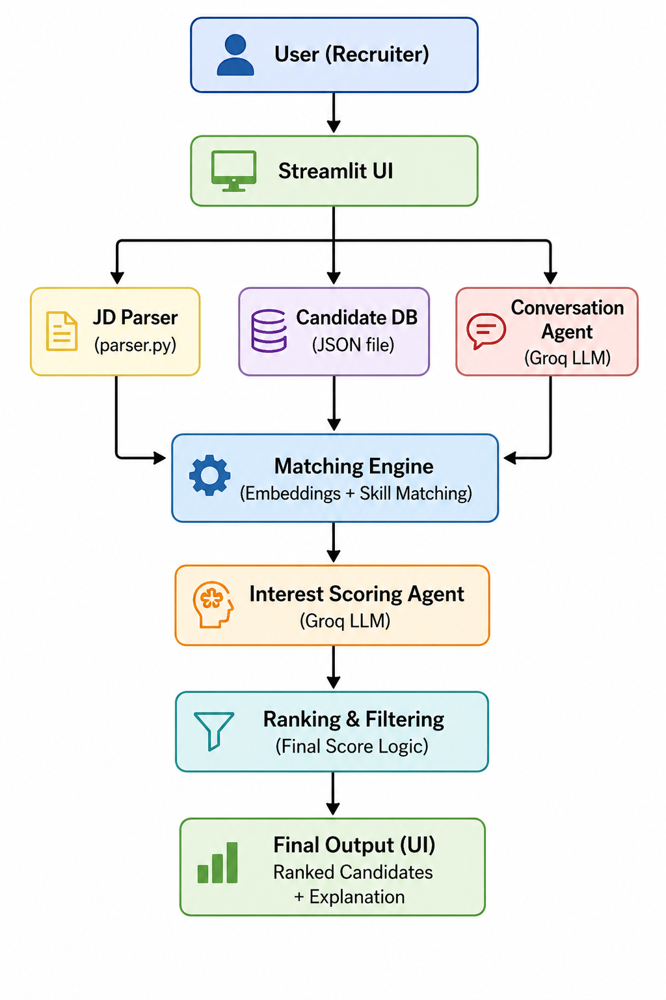

# 🤖 AI Talent Scouting & Engagement Agent

An end-to-end Agentic AI system that automates candidate discovery,
matching, engagement, and ranking using LLMs, embeddings, and
intelligent scoring.

## ✨ Key Features

-   📄 Job Description Parsing using LLM\
-   🔎 Semantic Candidate Matching (Embeddings + Skill Overlap)\
-   🧠 Explainable Match Scoring (matched & missing skills)\
-   📨 AI-Generated Recruiter Outreach\
-   💬 Simulated Candidate Responses\
-   📊 LLM-based Interest Scoring\
-   🏆 Final Ranking with Filtering\
-   🧾 Explainable Output for Recruiters

## 🧠 What It Solves

Recruiters spend hours: - Screening profiles\
- Assessing skill fit\
- Checking candidate interest

👉 This system automates:\
**Find → Engage → Evaluate → Rank**

## 🏗️ System Architecture

    

## ⚙️ Technology Stack

-   Language: Python\
-   UI: Streamlit\
-   LLM: Groq (LLaMA 3.1)\
-   Embeddings: SentenceTransformers\
-   Similarity: Cosine Similarity\
-   Data: JSON (candidate profiles)

## 🧩 Core Components

### 1. 📄 JD Parser

Extracts skills, role, and experience from job description using LLM

### 2. 🔎 Matching Engine

Uses: - Embeddings (semantic similarity)\
- Skill overlap

Outputs: - Match Score\
- Matched Skills\
- Missing Skills

### 3. 📨 Conversation Agent

-   Generates personalized recruiter messages\
-   Simulates candidate responses

### 4. 🧠 Interest Scoring Agent

Uses LLM to evaluate: - Interest level\
- Score\
- Reasoning

### 5. 🏆 Ranking & Filtering

-   Final score calculation\
-   Filters out:
    -   Low match candidates\
    -   Not interested candidates

## 📊 Scoring Logic

    Final Score = 0.6 × Match Score + 0.4 × Interest Score

### Match Score

-   Semantic similarity (embeddings)\
-   Skill overlap

### Interest Score

-   LLM-based classification of candidate response

## 📂 Project Structure

    project/
    │
    ├── app.py
    ├── data/
    │   └── candidates.json
    ├── utils/
    │   ├── parser.py
    │   ├── matcher.py
    │   ├── conversation.py
    │   └── scoring.py
    ├── requirements.txt
    ├── README.md

## 🚀 Setup and Installation

### Prerequisites

-   Python 3.10+\
-   Internet connection (for LLM APIs)

### 1. Clone the Repository

    git clone https://github.com/your-username/ai-talent-agent.git
    cd ai-talent-agent

### 2. Create Virtual Environment

#### Windows

    python -m venv venv
    venv\Scripts\activate

#### macOS/Linux

    python3 -m venv venv
    source venv/bin/activate

### 3. Install Dependencies

    pip install -r requirements.txt

### 4. Setup API Key

Create `.env` file:

    GROQ_API_KEY=your_api_key_here

## ▶️ Run the Application

    streamlit run app.py

Open in browser:\
http://localhost:8501

## 🧪 How to Use

1.  Paste a Job Description\
2.  Click Run Agent

System will: - Parse JD\
- Match candidates\
- Simulate outreach\
- Score interest\
- Rank candidates

View: - 🏆 Top candidate\
- 📊 Scores\
- 🧠 Explanations\
- 💬 Conversation

## 📥 Sample Input

Machine Learning Engineer

Skills: - Python\
- NLP\
- Deep Learning

Experience: 2+ years

## 📤 Sample Output

Top Candidate: Aman

-   Match Score: \~65\
-   Interest Score: \~80\
-   Final Score: \~71

**Reason:** - Matches key skills (Python, NLP, ML)\
- Shows strong interest

## 💡 Key Highlights

-   Combines semantic search + agentic AI\
-   Provides explainable decisions\
-   Simulates real recruiter workflows\
-   Fully end-to-end automation

## 🏁 Conclusion

This project demonstrates how **Agentic AI + LLMs + embeddings** can
transform recruitment into an:

> Intelligent, automated, and explainable system
